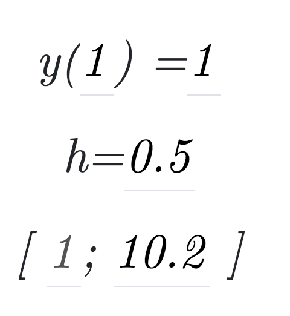
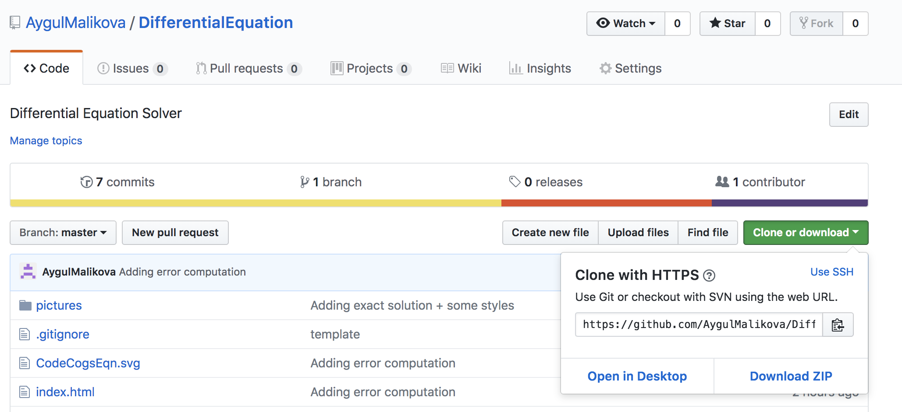
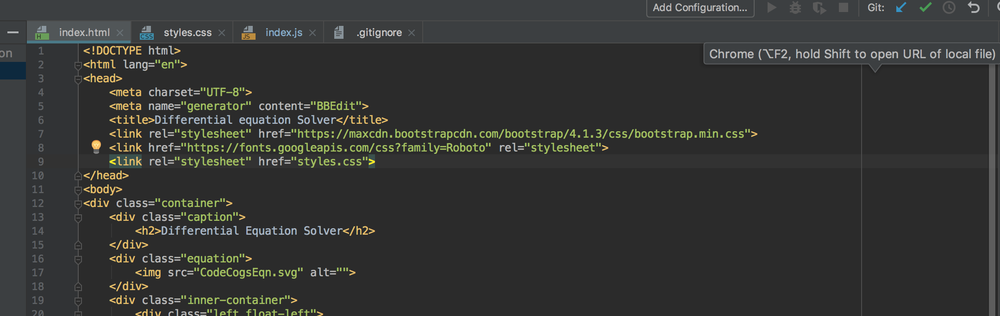
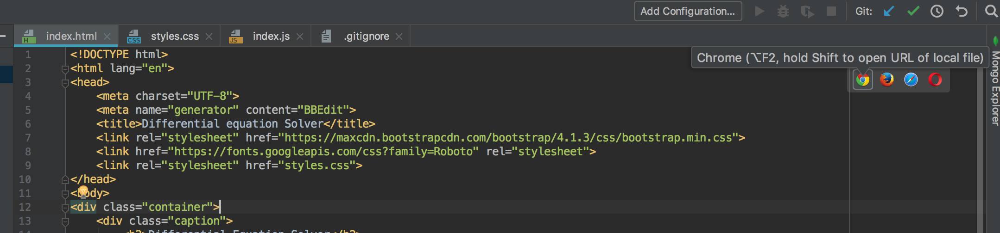
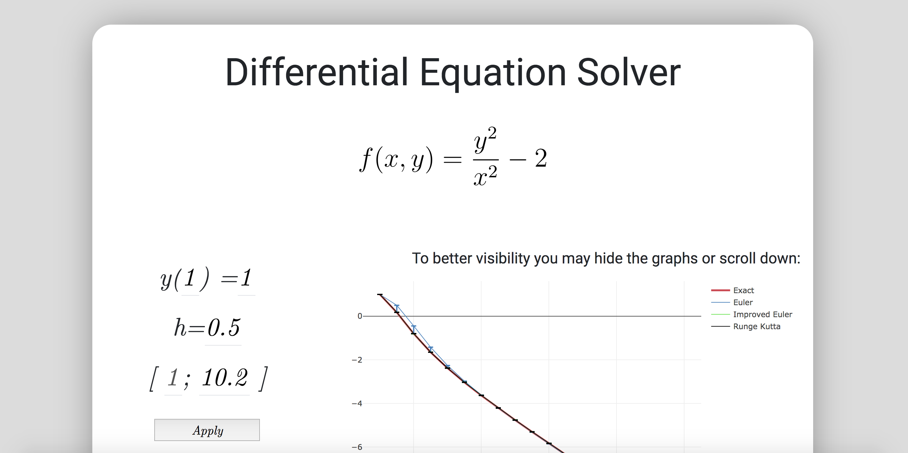
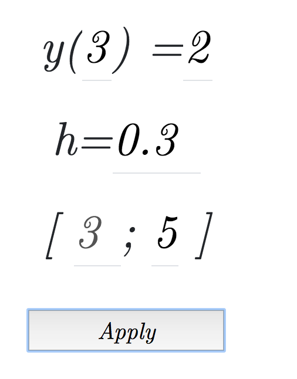
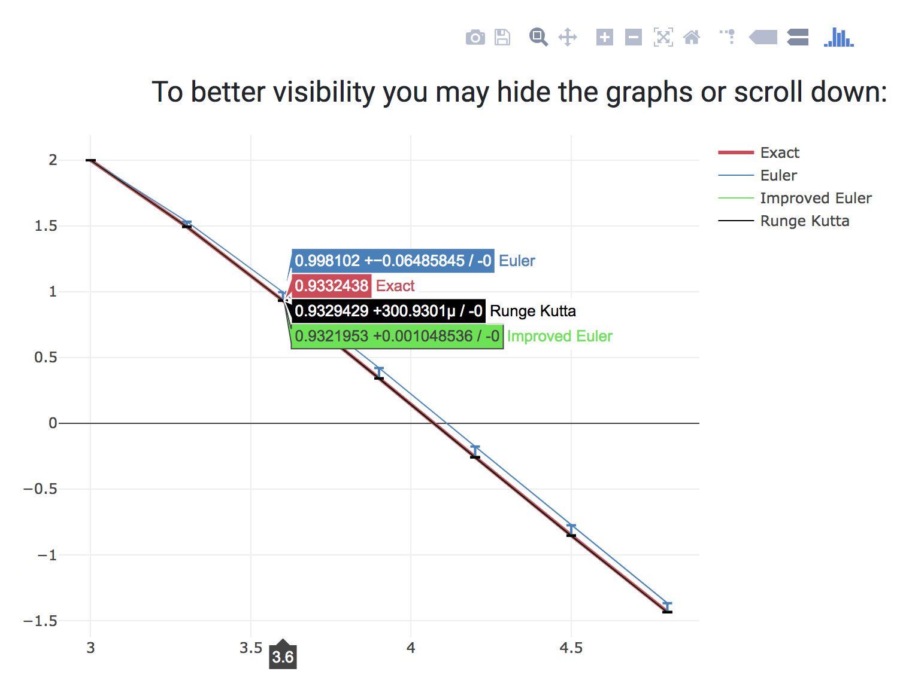

## REPORT WRITING

### A Differential Equation Solver Application

By Malikova Aygul

Course: BS17-06, Bachelor
TA: Mingazov Marat

Innopolis University
2018

---
### Contents
+ <a href="#about">About</a>
+ <a href="#stack">Stack of used technologies</a>
+ <a href="#install">How to install</a>
+ <a href="#usage">How to use</a>
+ <a href="#more">More</a>

<a name="about">

## About
</a>

This is a project for Differential Equation computational practicum. 
The main objective is to produce numerical methods (Euler, Improved Euler and Runge Kutta) for solving 1st order ODE graphically. 
The equation with initial values is given: 

 

<a name="stack">

## Stack of used technologies
</a>

In order to create a convenient and understandable interface with the user, I decided to make a web-application using the following technologies:
+ HTML 5
+ CSS 3
+ ECMAScript 6
Additional:
+ Online editor for translating into LateX (https://www.codecogs.com/latex/eqneditor.php)
+ Library for plotting (https://plot.ly/javascript/getting-started/#plotlyjs-cdn)

<a name="install">

## How to install
</a>

1. Download project on your computer

 

2. Open in editor that supports HTML, CSS and JS 
(I Use WebStorm)

3. Сheck for compatibility of versions used in the project
(See <a href="#stack">here</a>)
4. Project should has this structure: 

 
 
5. Open index.html 
6. In the upper right corner find icons of browsers and open in one of them
(I Use Chrome)

 

7. Page in your browser

 
 
 
<a name="usage">

## How to use

</a>
As you open the page the graphs (general with all 4 methods) and separated (exact - euler, exact - improved euler, exact - runge kutta)
are plotted with initial values.
You may input new values and press apply to reload page with changes.

 
 
And you will get new results
 
 

Note that when pointing to a point in the graph, you can also see the locale errors.

<a name="more">

## More

For a more detailed description of the application, 
solutions and other things, please read the 

